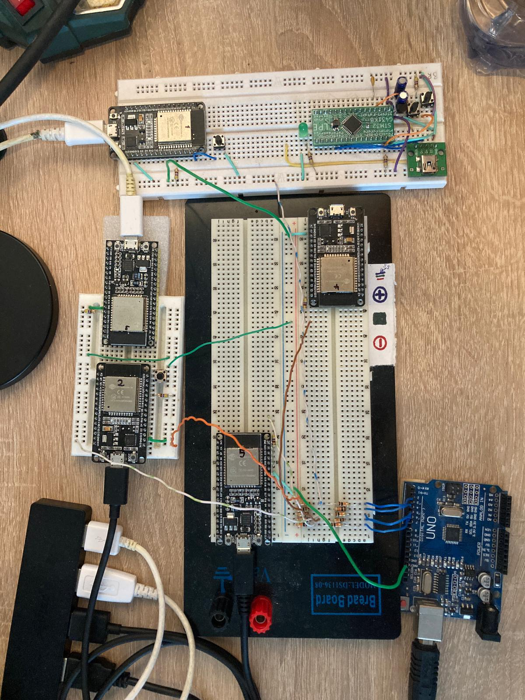

# Hlasovací zařízení řešící koncenzus v distribuovaném systému

> [!NOTE]
> Generovano pomoc chatGPT z report.pdf

## Úvod

Cílem projektu bylo zrobustnit algoritmus, který obsluhuje distribuovanou síť tvořenou hlasovacími zařízeními. Konkrétně bylo cílem ošetřit chybové stavy a navrhnout a implementovat přístup, který zajistí, že v síti bude moci být připojeno 1–N zařízení.

Síť je postavena na zařízeních ESP32, která jsou propojena pomocí protokolu ESP-NOW. Tento protokol spojuje horních pět vrstev OSI modelu do jedné, zvané ESP-NOW. Protokol má určité limity, jako je počet sousedů (maximálně 20 nešifrovaných) a velikost zprávy (maximálně 250 B). Tyto limity bylo nutné zohlednit při návrhu a implementaci.


## Algoritmus a implementace

Algoritmus tvoří tři základní komponenty: 

1. Registrace zařízení do distribuované sítě (DS)
2. Běžný chod a terminace zařízení
3. Synchronizace času, distribuce logů a seznamu zařízení

### Registrace zařízení

Po spuštění zařízení odešle broadcast zprávu typu `HELLO_DS`. Ostatní zařízení v síti si jej přidají do seznamu sousedů a odešlou zprávu typu `NEIGHBOURS` s informacemi o DS (např. ID epochy). Pokud zařízení obdrží více než polovinu odpovědí, přechází do další fáze – běžného chodu DS.

### Běžný chod

Každá epocha má dvě fáze:

1. **Volba lídra**: Probíhá podobně jako v algoritmu Raft. Lídr synchronizuje čas pomocí zpráv typu `TIME`. Pokud zařízení neobdrží zprávu do určitého timeoutu, spustí nové volby.
2. **Běžný provoz**: Lídr distribuuje logy, seznamy sousedů a synchronizační zprávy. Pokud dojde k selhání zařízení, uživatel je informován o stavu.

#### Role zařízení

- **Lídr (MASTER)**: Rozesílá logy, seznamy sousedů a synchronizuje čas.
- **Následovník (SLAVE)**: Pasivní zařízení.
- **Kandidát**: Přechodná role během volby lídra.

### Terminace zařízení

Zařízení, které nepřijme více než tři zprávy úspěšně, je označeno jako neaktivní a terminováno z DS. Tato informace je poté rozeslána do celé sítě.

### Přizpůsobení dynamickému počtu sousedů

- **Ukládání dat**: Použit statický způsob ukládání sousedů (20 × 16 bytes) kvůli menší chybovosti a nižší výpočetní zátěži.
- **Struktura packetu**: Přidán checksum typu `uint32_t`, reprezentující stav sousedů.
- **Nový typ zprávy**: Zpráva obsahující seznam sousedů rozdělena na dvě části kvůli limitu velikosti zprávy.




## Spuštění kódu

Pro spuštění kódu je třeba mít nainstalovaný framework `esp-idf`.

```bash
# Klonování repozitáře esp-idf
git clone https://github.com/espressif/esp-idf.git
# Přepnutí na vhodný release (testováno na v5.4)
cd esp-idf
./install.bat  # Nebo jiný vhodný instalátor pro použitý systém
```

### Kompilace a flashování

Pro kompilaci a flashování kódu:

```bash
idf.py reconfigure  # Stažení a instalace komponent ESP-NOW
idf.py build
idf.py flash
idf.py monitor
```

Doporučuje se nastavit automatické spuštění exportu. Při použití připraveného VSCode prostředí a správné konfiguraci cesty k esp-idf knihovně se export spustí automaticky při otevření terminálu.
