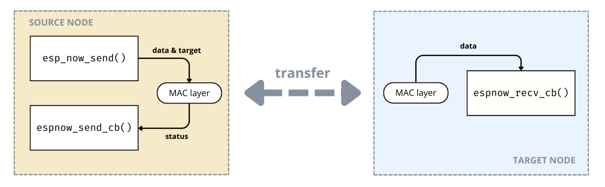
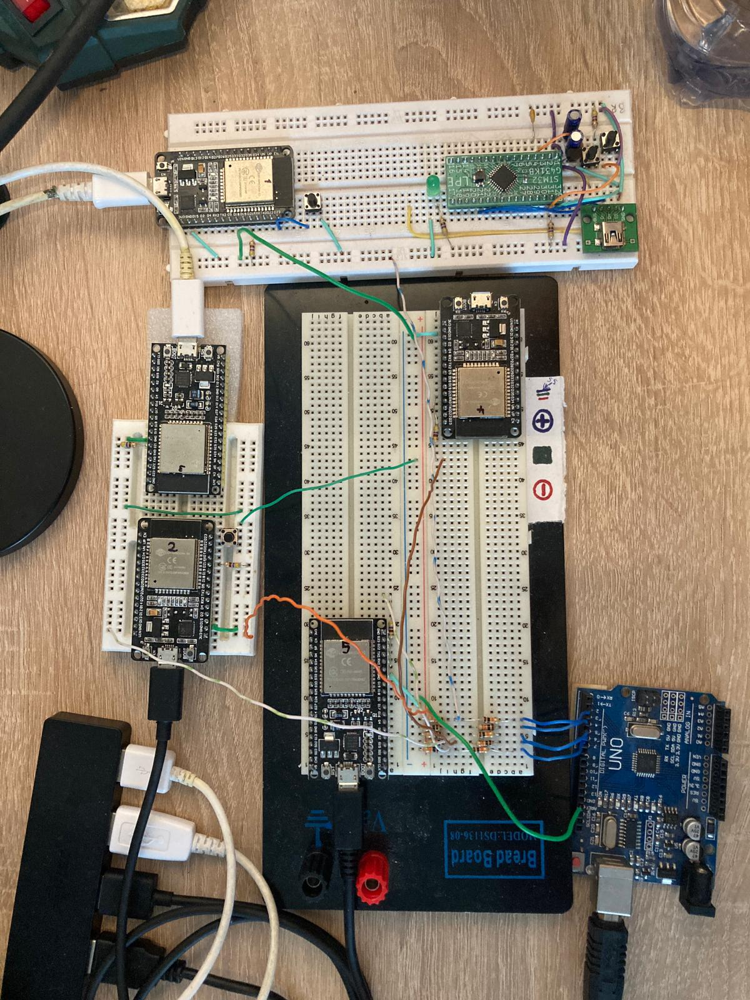

# Distribuovaný systém IoT zařízení řešící problém konsenzu
## DSVA

---
<!--
backgroundColor: "#FFF"
header: ""
 -->

# Požadavky na systém

- řešení určení pořadí
- autonomnost zařízení
- distribuovaný systém
- bezdrátová komunikace
- maximální chyba 1 ms

<!-- footer: "**POŽADAVKY** | SÍŤOVÁ INFRA | ALGORITMUS | REALIZCE" -->

---

# Protokol ESP-NOW

- 2. vrstva ISO/OSI modelu
- *callback* funkce, broad/unicast 
- limity protokolu

<!-- footer: "POŽADAVKY | **SÍŤOVÁ INFRA** | ALGORITMUS | REALIZCE" -->

---

<!-- footer: "POŽADAVKY | SÍŤOVÁ INFRA | **ALGORITMUS** | REALIZCE" -->

<!-- # Algoritmus

- požadavky
  - koncenzus - shoda na uspořádání
- distribuovaný systém (DS)
- kauzalita a čas, konsenzus

--- -->

# Rozbor problému

- určení pořadí událostí
  → kauzalita / **časová značka**
- dílčí problémy
  - synchronizace času DS
  - distribuce logů
  - distribuce seznamu zařízení DS

---

# Celkový alogritmus

1. Registrace zařízení do DS
2. Běžný chod (epochy)
   1. volby lídra
   2. běžný provoz (logy, čas)
3. Terminace zařízení z DS

---

<!-- footer: "POŽADAVKY | SÍŤOVÁ INFRA | ALGORITMUS | **REALIZCE**" -->

# Realizace

- FreeRTOS, ESP-IDF
- základem je stavový automat
- unifikovaná velikost zprávy
- Doxygen dokumentace
  

---

<!-- footer: "POŽADAVKY | SÍŤOVÁ INFRA | ALGORITMUS | **REALIZCE**" -->

# Dynamický počet sousedů

- ukládání dat
- struktura packetu - checksum typu `uint32_t`
- nový typ zprávy 

---

<!-- footer: "" -->

<!-- # Testované scénáře
- běžný chod
- kauzalita 2 blízkých událostí *(do 1 ms)*
- odpojení zařízení a opětovné zapojení do sítě -->

---

<!-- footer: "Petr Kučera | kucerp28@fel.cvut.cz | [github.com/petrkucerak/rafting-button](https://github.com/petrkucerak/rafting-button)"
backgroundColor: ""
-->

# Distribuovaný systém IoT zařízení řešící problém konsenzu
