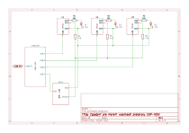
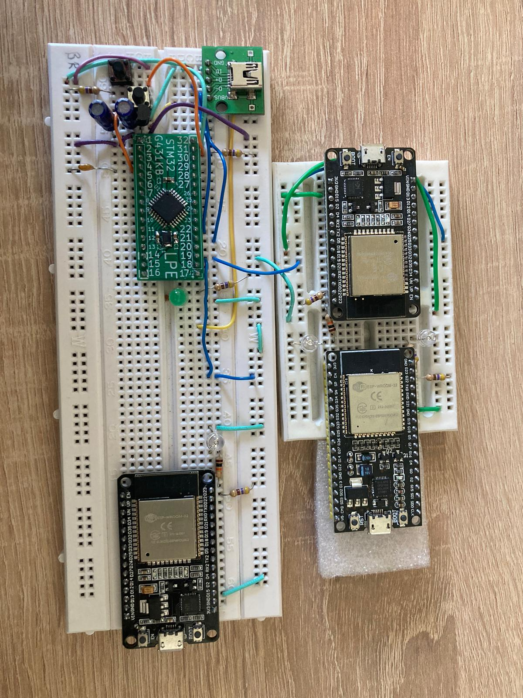

Cílem tohoto projektu je změřit **latenci protokolu esp-now** běžícího na modulech **esp32**. To takovým způsobem, že jsou všechna zařízení propojena vdičem, který synchronizuje jejich vnitřní hodiny a po odeslání se spočítá čas příjmu dané zprávy.

## Příkazy

```
idf.py build
idf.py -p <PORT> flash
idf.py monitor
```

## Schéma zapojení




## Koncept měření

Měřící sestava obsahuje 3 ESP32 a jedno STM32 (STM32G431KB používá se pro výuku předmětu LPE). STM32 generuje pomocí PWM pulz, který slouží k syncrhonizaci hodin v DS. ESP32 mezi sebou vysílají zprávu pomocí níž se spočítá latence.

**Měření latence** probíhá přesně následujícím způsobem:
1. Zařízení A odešle do zařízení B a C zprávu se synchronizovaným časem odeslání
2. Zařízení B a C zprávu přijmou a spočítají latenci, tedy dobu od odeslání (zapasání zprávy se sycnhronziovaným časem) do přijmutím zprávy (spuštění callback funkce a provedení výpočtu latence). Latence se následně počítá jako
   $$
   t_l = T_{B,C}-T_A
   $$
   - $T_l$ ... velikost latence
   - $T_A$ ... čas ve zprávě, resp. čas odeslání
   - $T_{B,C}$ ... čas přijmutí zprávy

**Čas je** v ESP32 **synchronizován** pomocí pulzů z PWM generovaného STM32. To tak, že při registraci náběžné hrany na vstupním pinu (nastaveno na GPIO_NUM_21) se generuje přerušení (ISR), které uloží aktulání hodnotu globálního času od spuštění a prohlásí ji za výchozí čas synchronizace ($T_s$). Čas DS se následně počít jako

   $$
   T_{DS} = T_g - T_s
   $$
   - $T_{DS}$ ... čas synchronizovaný v DS
   - $T_g$ ... globální čas běhu daného zařízení
   - $T_s$ ... doba synchornizace času

**Veškeré naměření hodnoty jsou udávány v *µs*.**

### Technické poznámky

- Čas je synchronziován s průměrnou odchylkou okolo *173 µs*. Tato hodnota byla určena měřením kdy je generován pulz o frekvenci 1Hz, perioda je tedy 1 s. A ISR halder funkce vždy spočítá čas čas od předchozího běhu a vynuluje $T_s$. Zpoždění je dáno režijními náklady běhu procesoru. Maximální odchylka byla určená také měřením a při běhu 24 min a 18 s dosáhla maximální hodnoty *810 µs*. Původně jsem se domníval, že overhead je veliký především kvůlu funkci `esp_timer_get_time()` z důvodu dohledané diskuze https://esp32.com/viewtopic.php?t=16228. Experimentem jsem ale ověřil, že tato funkce není hlavní brzdou při měření. Prodluvu se mi ale povedlo snížit přetaktováním na 240 MHz a optimalizací kódu.


