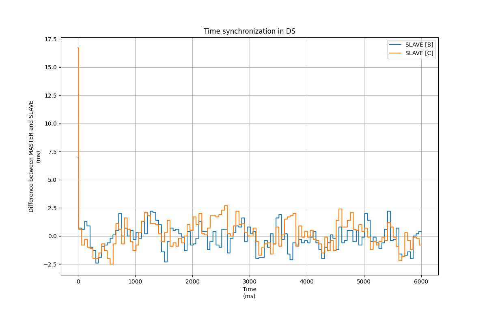
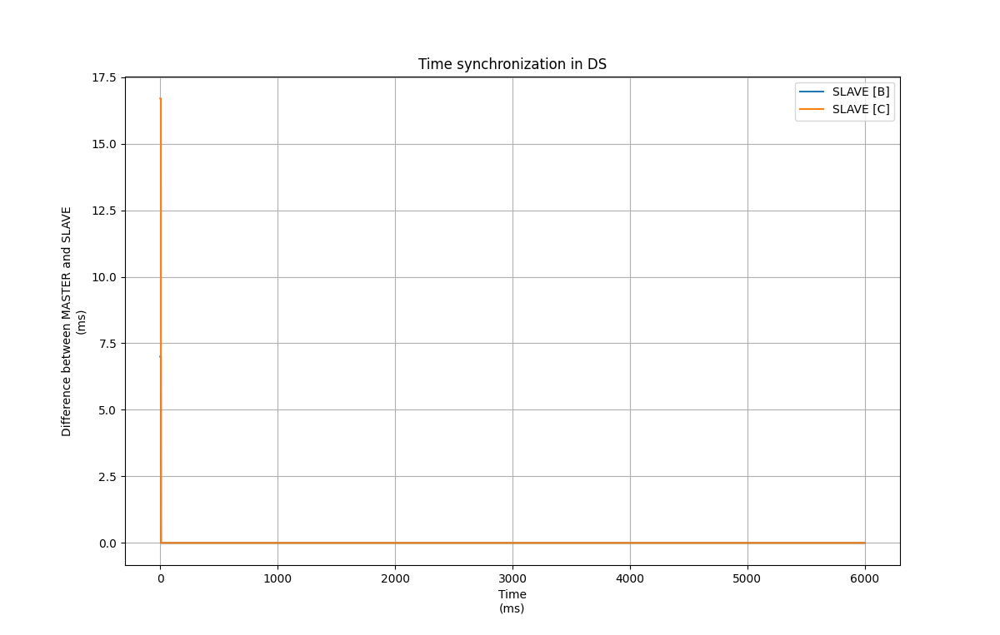
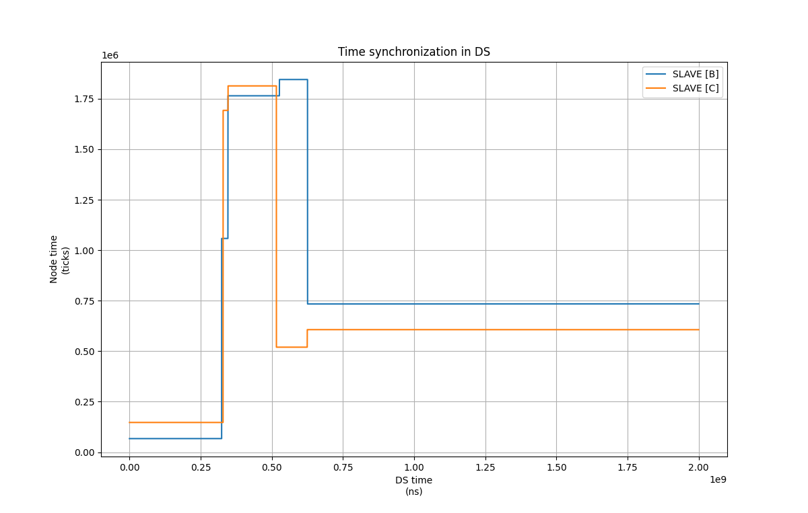
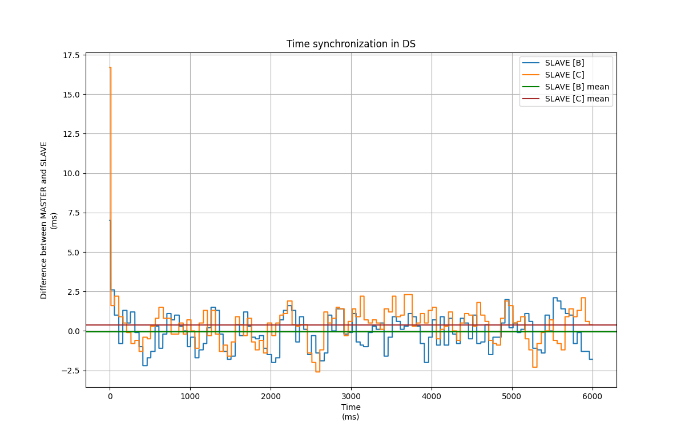
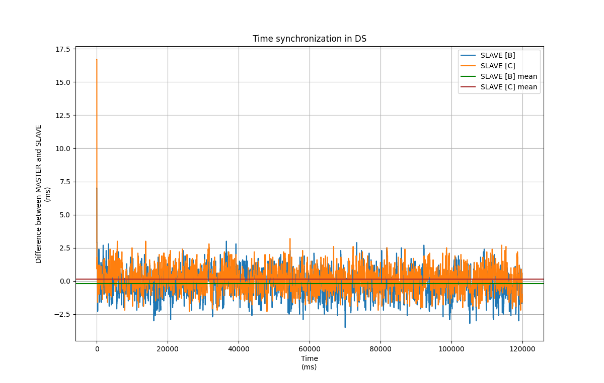

# Scenarios

Předpoklady pro simulaci jsou takové, že:

- zpoždění odesílání signálů je rozdílné a náhodné v rozmezí od 1 ms do 6 ms (tyto hodnoty byly zjištěny předchozím experimentem)
- zpomalení osciálátoru procesoru zanedbáváme jelikož se jedná o ±10 ppm [[1]](https://docs.espressif.com/projects/esp-idf/en/latest/esp32/api-reference/system/system_time.html)

## B1

Simulace v tomto případě osciluje okolo nulového rozdílu v rozmezí až do 2.5 ms zpoždění. Vhodné v dalších simulacích otestovat přesnost střední hodnoty.

- **náhodně zpoždění na všech uzlech v rozmezí od 1 - 6 ms**
- synchronizační zpráva odesílaná každých 50 ms
- doba simulace je 6 s

## B2

Pokud je zpoždění konstatní, alogritmus funguje perfektně. V praxi tato situace neexistuje.

- **konstatní zpoždění na všech uzlech stejné**
- synchronizační zpráva odesílaná každých 50 ms
- doba simulace je 6 s

## B3

Zpoždění jsou konstatní ale na každém uzlu rozdílné. V tomto případě alogritmus nefunguje správně, jelikož se liší doba odesílá v závilsoti na směrech.

- **konstatní zpoždění na rozdílné na uzlech**
  - A (MATER) 1 ms
  - B (SALVE) 1.2 ms
  - C (SLAVE) 0.8 ms
- synchronizační zpráva odesílaná každých 50 ms
- doba simulace je 6 s

## C1

Simulace navíc počítá střední hodnotu z naměřených hodnot. Výsledná synchronizovaná hodnota je přesnější. Rozdíl pro s B uzlem je 0.048 ms a s C uzlm 0.390 při ěření po dobu 6 s.

- **náhodně zpoždění na všech uzlech v rozmezí od 1 - 6 ms**
- synchronizační zpráva odesílaná každých 50 ms
- doba simulace je 6 s

## C2

Scénář C2 oproti předchozímu prodlužuje dobu simulace na 2 minuty. Střední hodnota se ustálila na hodnotách 0.141 ms pro C a 0.188 ms pro B.

- **náhodně zpoždění na všech uzlech v rozmezí od 1 - 6 ms**
- synchronizační zpráva odesílaná každých 50 ms
- doba simulace je 120 s

