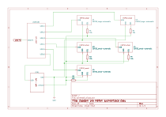
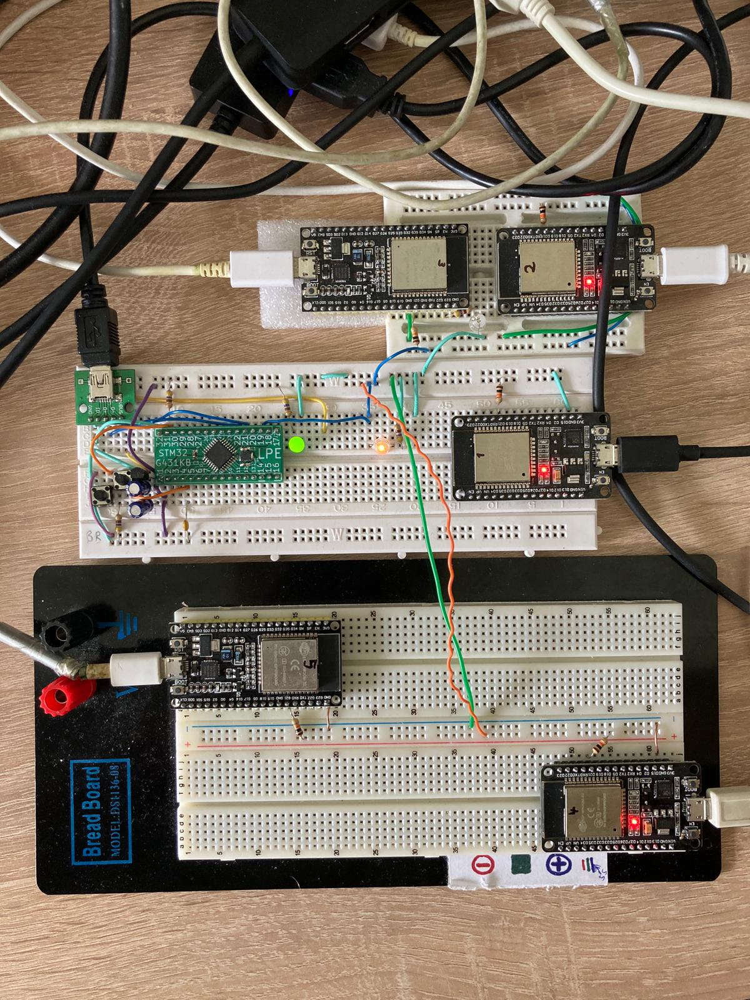

Cílem tohoto projektu je odsimulovat reálné užití navrženého algoritmu pro synchronizaci času.

## Příkazy

```
idf.py build
idf.py -p <PORT> flash
idf.py monitor
```

## Schéma zapojení




## Seznam zarizeni
  | NO  | type        | MAC address         | Note |
  | --- | ----------- | ------------------- | ---- |
  | 1   | ESP32 small | `70:b8:f6:5b:d3:24` | COM4 |
  |     | STM32       |                     | COM5 |
  | 2   | ESP32 small | `cc:db:a7:1d:c4:08` | COM6 |
  | 3   | ESP32 large | `c8:f0:9e:7b:10:8c` | COM7 |
  | 4   | ESP32 small | `cc:db:a7:1d:c7:cc` | COM8 |
  | 5   | ESP32 large | `94:b5:55:f9:f2:f0` | COM9 |
