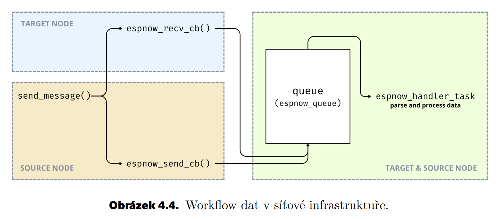

# Distribuovaný systém IoT zařízení řešící problém konsenzu
## Bakalářská práce

---
<!-- backgroundColor: "#FFF" -->

# Postup
1. Rešerše
2. Požadavky
3. Síťová infrastruktura
4. Algoritmické řešení
5. Realizace a testování
---

# Rešerše

- trendy
- úspora energie
- hirearchická struktura

<!-- footer: "**REŠERŠE** | POŽADAVKY | SÍŤOVÁ INFRA | ALGORITMUS | REALIZCE A MĚŘENÍ" -->

---

# Požadavky

- určení pořadí
- variabilita prostředí
- autonomní a distribuovaný systém
- přesnost 1 ms
- bezdrátová komunikace

<!-- footer: "REŠERŠE | **POŽADAVKY** | SÍŤOVÁ INFRA | ALGORITMUS | REALIZCE A MĚŘENÍ" -->

---

# Síťová infrastruktura

- volba vhodného modulu

<!-- footer: "REŠERŠE | POŽADAVKY | **SÍŤOVÁ INFRA** | ALGORITMUS | REALIZCE A MĚŘENÍ" -->

---

# Protokol ESP-NOW

- 2. vrstva ISO/OSI modelu
- *callback* funkce, broad/unicast 

---

# Protokol ESP-NOW

- limity protokolu
  - 250 bajtů
  - 10 zařízení
  - ESP-IDF / Arduino Framework
  - nekvalitní dokumentace

---

# Protokol ESP-NOW

- modifikovatelnost

---

# Protokol ESP-NOW

- měření
  - vzdálenost => chybovost
  - velikost => rychlost přenosu

---

---

<!-- footer: "REŠERŠE | POŽADAVKY | SÍŤOVÁ INFRA | **ALGORITMUS** | REALIZCE A MĚŘENÍ" -->

# Algoritmus

- požadavky
  - koncenzus - shoda na uspořádání
- distribuovaný systém (DS)
- kauzalita a čas, konsenzus

---

# Rozbor problému

- kauzalita / **časová značka**
- dílčí problémy
  - synchronizace času DS
  - distribuce logů
  - distribuce senzamu zařízení DS

---

# Synchronizace času

- ideální situace

$$
T_A = T_B + D_n + O_n,\:\:\: D_n = {RTT\over 2}
$$

- realita (předpoklad symetrie)

$$
T_A = T_B + \bar{D} + \bar{O}
$$

---

---

# Synchronizace času

- reálný hardware
  - časová značka
  - změna výpočtu

$$
T = T \pm K
$$

---

---

# Distribuce logů

$$
L= N(N-1) \:\: | \:\: L=2(N-1)
$$

