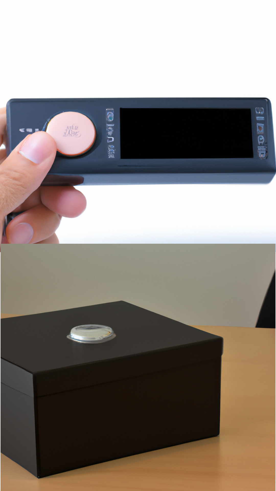

# Distribuovaný systém IoT zařízení řešící problém konsenzu
## Bakalářská práce

---
<!--
backgroundColor: "#FFF"
header: ""
 -->

# Postup
1. Rešerše
2. Požadavky
3. Síťová infrastruktura
4. Algoritmické řešení
5. Realizace a testování

---

# Požadavky na systém

- řešení určení pořadí
- autonomnost zařízení
- distribuovaný systém
- bezdrátová komunikace
- maximální chyba 1 ms

<!-- footer: "REŠERŠE | **POŽADAVKY** | SÍŤOVÁ INFRA | ALGORITMUS | REALIZCE A MĚŘENÍ" -->

---

# Síťová infrastruktura

- volba vhodného modulu

<!-- footer: "REŠERŠE | POŽADAVKY | **SÍŤOVÁ INFRA** | ALGORITMUS | REALIZCE A MĚŘENÍ" -->

---

# Protokol ESP-NOW

- 2. vrstva ISO/OSI modelu
- *callback* funkce, broad/unicast 
- limity protokolu

---

<!--

# Protokol ESP-NOW

- měření
  - vzdálenost => chybovost
  - velikost => rychlost přenosu
-->

---

<!-- footer: "REŠERŠE | POŽADAVKY | SÍŤOVÁ INFRA | **ALGORITMUS** | REALIZCE A MĚŘENÍ" -->

<!-- # Algoritmus

- požadavky
  - koncenzus - shoda na uspořádání
- distribuovaný systém (DS)
- kauzalita a čas, konsenzus

--- -->

# Rozbor problému

- určení pořadí událostí
  → kauzalita / **časová značka**
- dílčí problémy
  - synchronizace času DS
  - distribuce logů
  - distribuce seznamu zařízení DS

---

# Synchronizace času

- výpočet doby přenosu $D$
- $D = {RTT\over 2}$

<!-- ---

# Synchronizace času

## Odeslání času -->
- $T_M = T_S + \bar{D} + O$

<!--  -->

---

## Simulace

---

## Reálný hardware

---

# Synchronizace času

- na reálném zařízení negativní vliv velikých chyb a provozu FreeRTOS
<!-- - zlepšeno řešeno časovou značkou -->
- změna algoritmu:
  1. synchronizace je prováděna tradičně dokud není chyba $O$ menší než $O_{lim}$
  2. jakmile je chyba $O$ minimalizovaná, upravuj čas maximálně o konstantu $K$

<!-- konstanta K je chyba způsobená nepřeností osciálátoru 25 µs -->

---

## Reálný hardware

<!-- chyba způsobena tím, že MASTER hodiny jsou rychlejší -->

<!-- ---

# Distribuce logů

- bez MASTER uzlu: $L= N(N-1)$
- s MASTER uzlem: $L=2(N-1)$ -->

---

# Celkový alogritmus

1. Registrace zařízení do DS
2. Běžný chod (epochy)
   1. volby lídra
   2. běžný provoz (logy, čas)
3. Terminace zařízení z DS

---

<!-- footer: "REŠERŠE | POŽADAVKY | SÍŤOVÁ INFRA | ALGORITMUS | **REALIZCE A MĚŘENÍ**" -->

# Realizace

- FreeRTOS, ESP-IDF
- základem je stavový automat
- unifikovaná velikost zprávy
- Doxygen dokumentace
  

---

<!-- footer: "" -->

<!-- # Testované scénáře
- běžný chod
- kauzalita 2 blízkých událostí *(do 1 ms)*
- odpojení zařízení a opětovné zapojení do sítě -->

---

# Shrnutí

- uspořádání dle časové značky
- splněna maximální chyba 1 ms
- ESP-NOW, ESP-IDF a FreeRTOS
- poškození modulů a časová náročnost při práci s hardwarem

---

# Budoucnost projektu

- webový server
- robustnější distribuce logů
- podsítě
- mechanický návrh tlačítka a celého zařízení

---

<!-- footer: "Petr Kučera | kucerp28@fel.cvut.cz | [github.com/petrkucerak/rafting-button](https://github.com/petrkucerak/rafting-button)"
backgroundColor: ""
-->

# Distribuovaný systém IoT zařízení řešící problém konsenzu
